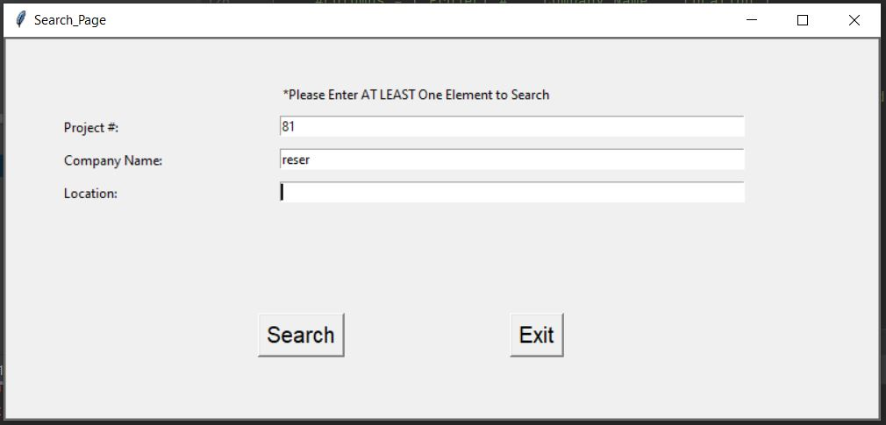
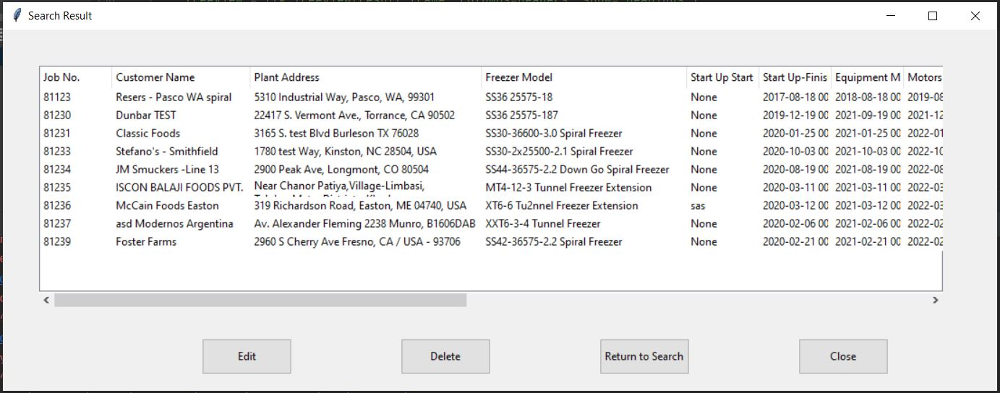
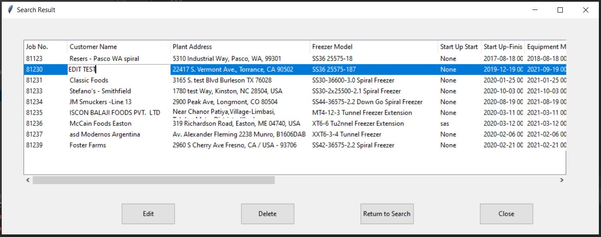
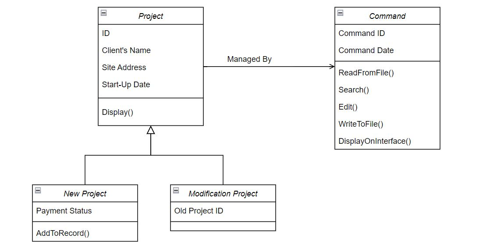

# Project-Record-Database-Management
Database Management with Python and SQL

## Introduction
Develop a user .exe application of Database management, to enable Record searching, entry adding and editing without manipulating in Excel. Requirements including:
1. Create an interface of ADD, SEARCH and EDIT functions.

2. Searching:  (search.py)
    1. Accept single or multiple elements searching
    2. Search regards of Lower or Capital Cases
    3. Enable scrollbars if the required space of results exceeds table (Treeview) size.
    

3. Editing: (edit.py)
    1. Available to change, add or delete contents in cells.
    2. Enacle "Double Click" to select cell and insert words and the same location.
    3. Update on original .xlsx file

    
## Development

### Object Oriented Project (OOP) Solution with C++

The pathway of my previous work is sequentially as briefly described in the diagram below. It is obervious that:
    - The complexity is exploding and
    - The flexibility is limited if I 'd like to add more functions,
    - The Product Time (Responding time) gets longer when Database gets larger.

As a result, I decided to try OOP programing so it can handle the large database in this case. The draft concept of classes and constructors is shown below. Codes can be found in OOP directory.

SQL server 

The idea of Database, attributes, and tuples comes from my work at FPS Corp Inc., however all values or contents have been changed or disordered for data security, and will not be used for any other purpose.
